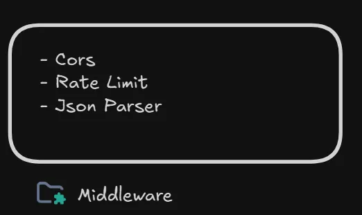
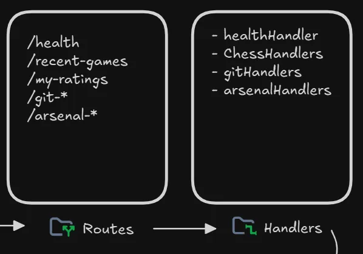
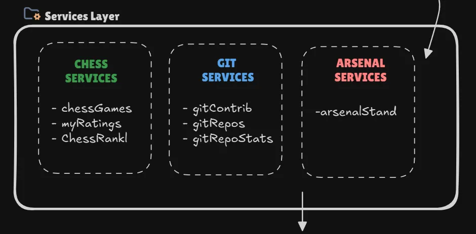
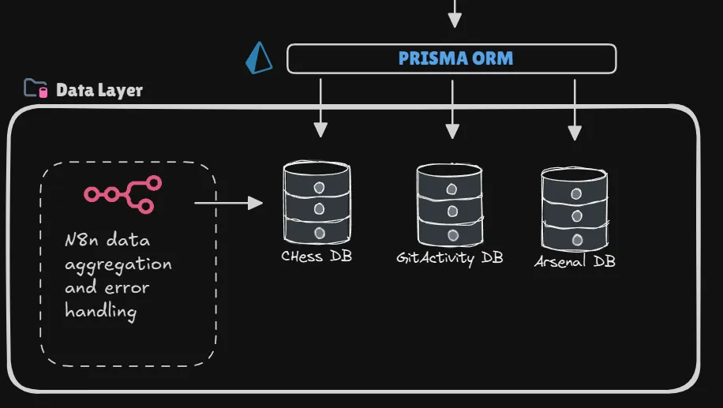

# Three.js Backend Server

---

## Summary
A multi-domain backend server powering the frontend of my personal portfolio. Built with **Node.js** and **Express**, it acts as a central hub for aggregating and serving personal data from various sources—such as **Chess.com stats**, **GitHub activity**, and **sports team standings**.  
Its main purpose is to provide a single, reliable API endpoint for the frontend to fetch and display **real-time information** about me.

---

## Motivation & Goals
Most portfolios are static, showcasing past projects. I wanted mine to be **dynamic**, reflecting who I am right now: my hobbies, coding activity, and interests. Instead of simply stating “I’m active in chess and coding,” this backend lets me **show it with live data**.

---

## Design & Architecture
The backend uses a **layered architecture**, making it easier to maintain and scale over time.

The diagram above looks complex at first, but it’s straightforward once broken down. Below, I explain the flow using the GitHub activity card as an example.

---

## The Breakdown

### **1. Client Request**
for e.g. : When the frontend loads a project card, it requests live GitHub activity via HTTPS:
> “Hey, do you have the latest GitHub activity for this project?”

---

### **2. Middleware**
- **CORS**: Ensures the request comes from an allowed origin.
- **Rate Limiting**: Blocks abuse (e.g., 100 requests/15 min).
- **Body Parsing**: Converts incoming JSON into usable objects.

---

### **3. Routing & Handlers**
- **Routing**: A path like `/git-repos` is matched to its route module.
- **Handlers**: Call a service function (e.g., `gitReposService`) without worrying about how it gets the data.

---

### **4. Service Layer**
This is where the **business logic** lives:
- Fetch repository details and sparkline data from the database.
- Pull real-time commits from the GitHub API.
- Combine and format everything into a structured response.

---

### **5. Data Layer**
- **Prisma ORM**: Type-safe database queries.
- **PostgreSQL Cache**: Keeps the API fast and reliable.
- **n8n Workflows**: Cron jobs aggregate data from Chess.com, GitHub, and ESPN.

---

### **6. Deployment**
- **Docker**: Containerizes the app for consistent behavior.
- **Scalability**: Easily scaled via load balancers.
- **Excalidraw Diagram**: [View Full Diagram](https://excalidraw.com/#json=FPHrPdujyqS9ax9nXoQQJ,7K88Gcy13QLJziXJFaJmhQ)

---

## Reflection

### **Biggest Challenge**
Building the backend **after** the frontend was a mistake. For example, my chess dashboard originally included opponent country flags, but Chess.com’s API didn’t provide that info. I had to add extra (slow) API calls for each game.

### **Key Takeaway**
Frontend and backend must be designed **together**. A good system balances what the frontend wants with what the backend can realistically provide.

### **What I’d Do Differently**
Next time, **read the API docs first**. Build around what’s possible, not just what looks cool.

---

## Tech Summary
- **Node.js + Express**
- **Prisma ORM + PostgreSQL**
- **Dockerized for deployment**
- **n8n Workflows for automation**
- **External APIs**: Chess.com, GitHub, ESPN
